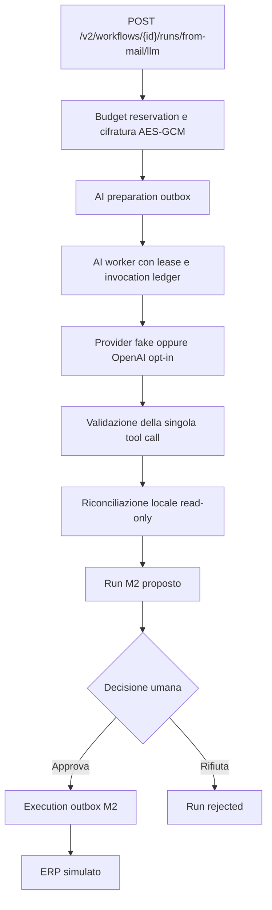
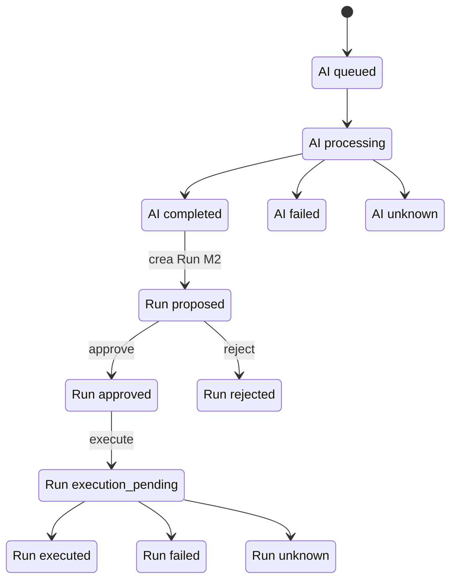

# ProntoAgente M3 — l'AI prepara la proposta ERP, una persona decide

**Obiettivo cliente.** Ridurre il lavoro manuale necessario per trasformare ordini
ricevuti via email in proposte ERP verificabili, mantenendo una persona responsabile
della decisione prima di qualsiasi scrittura.

**Valore dimostrato oggi.** Questa release valida offline il percorso tecnico governato:
preparazione asincrona, tool calling vincolato, riconciliazione, output strict,
approvazione obbligatoria, budget e audit. Non misura ancora risparmio di tempo, qualità
su ordini cliente o costo economico di un provider reale.

Il backend FastAPI conserva versioni di agenti e workflow, separa preparazione ed
esecuzione e usa worker outbox per rendere espliciti stato, responsabilità ed esiti
ambigui.

> [!IMPORTANT]
> **GO per la showcase offline; NO-GO e blocco esplicito per la produzione.** Mailbox ed
> ERP sono simulati e il percorso dimostrativo usa il provider `fake`. L'adapter OpenAI
> è solo opt-in, non-production e non è stato testato contro un endpoint live. Sono
> disponibili un solo prompt in-code (`email_order_extract/v1`) e un solo tool fisso
> (`demo_erp_reconcile_v1`). L'endpoint M3 è bloccato quando `APP_ENV=production`.

Milestone 1 fornisce il vertical slice ERP approval-first. Milestone 2 aggiunge API key,
isolamento tenant, RBAC, catalogo versionato e connettori allowlisted senza cambiare il
contratto M1. Milestone 3 aggiunge una preparazione AI asincrona con reservation di budget,
validazione fail-closed e ledger operativo, riusando invariato il lifecycle
Run/approve/execute di M2.

## KPI target da validare nel pilot

Questi valori sono **obiettivi proposti**, non risultati ottenuti dalla showcase offline:

| KPI cliente | Target da validare | Cosa può provare M3 oggi |
| --- | --- | --- |
| Tempo da email a proposta approvabile | Mediana inferiore a 2 minuti | La piattaforma registra durata e stati; il tempo su email/PDF reali non è ancora misurato. |
| Proposte approvate senza correzioni | Almeno 70% | Non misurato: provider e ordine della demo sono deterministici. |
| Completamento end-to-end | Almeno 95% sugli ordini eleggibili | Il percorso offline è verificabile, ma non rappresenta affidabilità di M365, provider o ERP reali. |
| Scritture prima dell'approvazione | Zero | Il gate è implementato nel lifecycle; non sono state provate scritture verso un ERP reale. |

Il ledger consente di misurare token e micro-USD. Il costo sostenibile per ordine dovrà
essere definito insieme al prezzo e al volume del pilot, non dedotto dal provider `fake`
a costo zero.

## Architettura reale della showcase M3



La chiamata al provider e la riconciliazione read-only avvengono **prima**
dell'approvazione del Run. Il controllo umano protegge la successiva azione di scrittura
ERP; questa implementazione non offre un gate separato prima dell'invio dei metadata al
provider né prima del tool read-only.



## Demo, pilot e produzione

| Fase | Perimetro verificabile | Stato e prerequisiti |
| --- | --- | --- |
| **Demo attuale** | Envelope `demo_mailbox_v1`, provider deterministico `fake`, riconciliazione locale, approvazione API e scrittura su `simulated_erp` | **GO per showcase offline.** `demo_m3.py` percorre l'intero flusso ma approva automaticamente: dimostra il gate tecnico, non una sessione umana interattiva. |
| **Pilot** | Adapter OpenAI opt-in in ambiente non-production; mailbox e destinazione ERP restano simulate nel percorso M3 | **Non ancora GO.** Validazione strict e bound conservativo pre-I/O sono implementati e verificati. Restano approvazione operativa del trattamento dati, demo manuale e verifiche live controllate di provider e PostgreSQL. |
| **Production** | Provider, email e ERP reali con controlli operativi completi | **NO-GO e bloccata.** M3 fallisce chiuso con `APP_ENV=production`; OpenAI e PostgreSQL non sono stati testati live e non esiste un collegamento M365 → preparazione LLM → ERP reale. |

## Matrice capability

Le etichette descrivono il perimetro di ciascuna milestone, non KPI di efficacia.

| Capability | M1 | M2 | M3 attuale |
| --- | --- | --- | --- |
| Lifecycle approval-first | **Completo** per il draft ERP | **Completo** per ogni Run | **Verificato nel perimetro M3**: protegge la scrittura ERP, non la chiamata provider/tool read-only |
| Catalogo Agent/Workflow versionato | Fuori scope | **Completo** | **Completo**, riusato da M2 |
| Auth, tenancy e RBAC | Fuori scope | **Completo** | **Completo**, riusato da M2 |
| Provider LLM | Fuori scope | Fuori scope | **Limitato**: fake offline e OpenAI opt-in, non-production e non testato live |
| Prompt versionati | Fuori scope | Fuori scope | **Limitato**: un prompt identificato e hashato, immutabile a runtime nel registry in-code |
| Tool calling governato | Fuori scope | Fuori scope | **Limitato**: un solo tool fisso, forced e read-only; nessun registry o gate dedicato |
| Validazione output | **Completo** nel contratto M1 | **Completo** per gli input deterministici M2 | **Verificata nel contratto fisso**: tool schema strict, modelli Pydantic strict `extra=forbid` e regole business; resta limitata a un solo prompt/tool |
| Budget e cost control | Fuori scope | Fuori scope | **Verificato nel perimetro fisso**: bound conservativo pre-I/O rispetto alla reservation; l'eventuale usage provider oltre reservation è contabilizzato e fallisce chiuso. Ledger operativo, non billing né previsione esatta del costo provider |
| Audit e osservabilità | **Completo** nel perimetro M1 | **Completo** per Run ed execution | **Limitato**: stato, hash, token, costo e durata; niente telemetry centralizzata o timeline AI pubblica |
| Showcase email → ERP | Fuori scope | **Limitato**: subject PA1 e sistemi simulati | **Limitato**: AI preparation su metadata sintetici e sistemi simulati |
| Read-only Microsoft 365 | Fuori scope | **Limitato**: adapter opt-in, non testato live | Non collegato al percorso M3 |
| Production readiness | Fuori scope | **Limitato**: PostgreSQL non testato live | Fuori scope e bloccata dal runtime |

## Contratti disponibili

- `/v2` è l'API tenant-scoped corrente. Richiede sempre
  `Authorization: Bearer pa2_<key_id>.<secret>`.
- `/v1/erp-drafts` resta identica alla baseline Milestone 1 in sviluppo e test. In
  `APP_ENV=production` è disabilitata, salvo `ENABLE_LEGACY_V1=true`.
- `GET /v1/health` segue la stessa regola di esposizione di `/v1`.

Il database memorizza solo prefix e HMAC-SHA256 della API key; il secret è mostrato una
sola volta dal bootstrap. `API_KEY_PEPPER` deve essere impostata in produzione. I ruoli
supportati sono `owner`, `builder`, `operator`, `approver` e `auditor`; un ID appartenente
ad altro tenant è deliberatamente indistinguibile da una risorsa inesistente (`404`).

## Avvio locale

Con `uv` e il lock incluso:

```bash
uv sync --extra dev --locked
uv run alembic upgrade head
API_KEY_PEPPER='local-secret-pepper' uv run python scripts/bootstrap_m2.py \
  --tenant-slug demo --tenant-name 'Demo tenant' \
  --owner-subject founder@demo.local --owner-name Founder
uv run uvicorn prontoagente.main:app --reload
```

Conservare il valore `api_key` stampato al primo bootstrap: una seconda esecuzione è
idempotente e mostra soltanto il prefix. Per una demo end-to-end locale:

```bash
export API_KEY_PEPPER='local-secret-pepper'
export PRONTOAGENTE_API_KEY='pa2_...'
uv run python scripts/demo_m2.py
```

Le variabili sono elencate in `.env.example`. PostgreSQL è disponibile installando
`uv sync --extra postgres` e usando un URL `postgresql+psycopg://...`; l'engine abilita
`pool_pre_ping`. Il DDL è compilato nei test per PostgreSQL, ma questa release non dichiara
una verifica contro un server PostgreSQL live.

## Catalogo e lifecycle v2

Un owner o builder crea `Agent` e `Workflow`, aggiunge una versione draft e la pubblica.
Una versione pubblicata è immutabile e una nuova versione usa il numero N+1. Ogni
`WorkflowVersion` pinna una `AgentVersion` già pubblicata e una coppia connector/action
del registry statico. Tutti i workflow richiedono approvazione: `approval_required=false`
è rifiutato dall'API e da un CHECK del database.

Le route principali sono:

- `GET /v2/me`, `GET /v2/connectors`;
- `GET|POST /v2/agents`, `GET /v2/agents/{id}` e version create/edit/publish;
- equivalenti route sotto `/v2/workflows`;
- `POST /v2/workflows/{id}/runs/dry-run` oppure `/runs/from-mail`, quindi
  GET/approve/reject/execute del run;
- `GET /v2/execution-operations/{id}` e `GET /v2/runs/{id}/audit-events`.

Le mutation del lifecycle run richiedono `Idempotency-Key` (8–128 caratteri), con
namespace per tenant e operazione. Dry-run salva snapshot di entrambe le versioni,
proposta, hash, summary, target e payload. Approve verifica l'hash persistito ma non
esegue alcun connector; execute è ammesso esclusivamente dallo stato `approved`. Le
transizioni approve/reject/execute usano compare-and-set sullo stato, quindi una race ha
un solo vincitore. Execute crea atomicamente una `ExecutionOperation` e un evento
outbox, risponde `202` e non effettua rete nella richiesta HTTP.

Il worker si avvia con:

```bash
uv run python -m prontoagente.worker --once
# oppure, senza --once, polling continuo
uv run python -m prontoagente.worker
```

Il worker acquisisce un lease e fa commit prima dell'I/O, usa `operation_id` come token
di deduplica, quindi finalizza atomicamente run, operation, outbox, audit e replay
idempotente. La finalizzazione usa `lease_owner` come fence e scarta risultati di worker
che hanno perso il lease. `proposal`/`proposal_hash`, versioni pubblicate e audit sono
protetti da guard ORM e trigger DB. Un connector reale deve inoltre deduplicare sul
sistema remoto: timeout o crash dopo l'invio possono produrre stato `unknown` e richiedono
riconciliazione, non un retry cieco.

## Showcase offline: email sintetica → ordine riconciliato

`POST /v2/workflows/{workflow_id}/runs/from-mail` è una thin slice dimostrativa, non un
connector runtime. Mailbox ed ERP sono simulati: non vengono letti body o allegati e non
sono eseguiti OCR, LLM, chiamate di rete o scritture su un ERP reale. Accetta solo
owner/operator e un envelope sintetico `demo_mailbox_v1`; il subject PA1 è l'input
dimostrativo. Il workflow deve essere già pubblicato e puntare esattamente a
`simulated_erp/create_sales_order`. Il normale ciclo approve/reject/execute e l'outbox non
cambiano.

La feature è disabilitata per default con `ENABLE_DEMO_CONNECTORS=false` ed è sempre
fail-closed quando `APP_ENV=production`, anche se il flag venisse impostato per errore.
Il formato subject PA1 è chiuso e versionato:

```text
PA1;order=PO-1001;customer=CUST-42;currency=EUR;lines=SKU-A:2:49.90,SKU-B:1:10.00
```

Sono ammessi solo EUR, codici ASCII allowlisted, quantità positive limitate, prezzi con
esattamente due decimali, massimo 20 SKU unici e 512 caratteri complessivi. Il catalogo
ERP locale `demo-erp-catalog-v1` contiene casi deterministici: `PO-1001` coincide;
`PO-1002` produce un mismatch quantità e una SKU mancante per ciascun lato. Le righe sono
ordinate per SKU e possono risultare `MATCH`, `QTY_MISMATCH`, `PRICE_MISMATCH`,
`MISSING_IN_ERP` o `MISSING_IN_EMAIL`.

Subject, sender e identificatori del messaggio non vengono salvati in Run, audit,
idempotenza o risposta. Viene persistito soltanto un riferimento SHA-256 derivato dagli
identificatori sorgente, oltre a parser/catalog version, ordine canonico e risultato di
riconciliazione. `OrderSourceClaim` impedisce che la stessa sorgente crei due Run nello
stesso tenant anche in race; una chiave idempotente ripetuta restituisce lo stesso Run.

Runbook locale, dopo bootstrap e migrazioni:

```bash
export APP_ENV=development
export ENABLE_DEMO_CONNECTORS=true
export API_KEY_PEPPER='local-secret-pepper'
export PRONTOAGENTE_API_KEY='pa2_...'
uv run alembic upgrade head
uv run python scripts/demo_order_showcase.py
```

## Milestone 3: preparazione AI governata

`POST /v2/workflows/{workflow_id}/runs/from-mail/llm` aggiunge una preparazione asincrona
senza modificare approve/reject/execute o il worker M2. La richiesta HTTP cifra l'envelope
con AES-GCM, prenota atomicamente token/costo nella policy tenant, crea operation e outbox,
quindi risponde `202` senza I/O esterno. `python -m prontoagente.ai.worker` acquisisce un
lease, registra e committa l'invocation prima dell'I/O, valida esattamente una tool call
read-only e riconcilia localmente. Solo allora crea un normale Run M2. Un crash dopo il
claim non causa una seconda spesa: l'esito diventa `unknown` e richiede riconciliazione.
La reservation resta contabilizzata negli esiti ambigui; il prototipo non include ancora
il job amministrativo che la rilascia o la contabilizza definitivamente.

Il provider viene quindi invocato durante la preparazione, prima che esista un Run da
approvare. L'intero percorso M3 è disabilitato quando `APP_ENV=production`, anche con i
flag impostati; questa release è esclusivamente un prototipo locale.

Il prompt in-code `email_order_extract/v1` separa system prompt e metadata email non
attendibili, è identificato e hashato ed è immutabile a runtime nel registry. Non esiste
ancora un catalogo prompt persistente con lifecycle draft/publish. L'unico tool è
`demo_erp_reconcile_v1`, con JSON Schema strict e output Pydantic `extra=forbid`; il
modello determina i campi dell'ordine proposto, ma non connector, action, target né le
decisioni di approvazione/esecuzione. L'orchestratore ricostruisce sempre il payload
canonico. Qualsiasi tool sconosciuto, chiamata multipla o argomento malformato fallisce
chiuso senza Run né outbox M2.

Prima dell'I/O il servizio calcola un bound conservativo dell'input visibile al provider,
includendo prompt, metadata, descrizione/schema del tool e un margine di protocollo; il
worker lo ricalcola immediatamente prima della richiesta. Se il bound supera i token
riservati, la chiamata non parte. Il bound è intenzionalmente prudente, ma non è una
previsione perfetta del tokenizer o del billing del provider. Se l'usage restituito dal
provider supera comunque la reservation, il consumo effettivo viene contabilizzato e
l'operazione fallisce chiusa senza creare il Run M2. Una riconciliazione con blocker può
produrre un Run proposto, ma `approval_eligible=false` e CHECK/guard DB ne impediscono
approvazione ed esecuzione.

Il provider predefinito `fake` interpreta soltanto PA1, è deterministico e non apre
socket. L'adapter `openai` è Responses-compatible, opt-in e destinato esclusivamente a
verifiche controllate non-production: richiede contemporaneamente `AI_NETWORK_ENABLED`,
policy tenant `network_enabled`, URL HTTPS deployment-controlled, host e model allowlist,
API key e pricing configurato. Redirect, risposta oltre limite, tool paralleli e selezione
libera del tool sono disabilitati. I test usano esclusivamente `httpx.MockTransport`;
l'adapter non è stato testato contro un endpoint live.

Policy, ledger operativo e stato (non telemetry completa):

- owner: `PUT /v2/ai/policy` con optimistic lock e `Idempotency-Key`;
- owner/auditor: `GET /v2/ai/policy` e `GET /v2/ai/usage`;
- ruoli v2: `GET /v2/ai-preparations/{id}`, sempre tenant-scoped;
- ledger: provider/model, correlation id, prompt hash e tool name, durata, token, micro-USD,
  input/output hash ed error code sanitizzato; è contabilità operativa, non billing.

Subject, sender, ordine/SKU, prompt/risposta/tool arguments, API key ed error body provider
non entrano in operation response, audit o log. L'input di coda è l'unica copia dei
metadata raw ed è cifrato; la chiave resta solo in environment. Il prototipo supporta una
chiave attiva per processo: ruotarla richiede prima drenare la coda della key-id precedente.

Runbook della demo tecnica offline (mailbox, provider ed ERP tutti simulati). Lo script
auto-approva ed esegue soltanto sul connector ERP simulato:

```bash
export APP_ENV=development
export ENABLE_DEMO_CONNECTORS=true
export AI_PREPARATION_ENABLED=true
export AI_NETWORK_ENABLED=false
export AI_ENCRYPTION_KEY_ID='local-v1'
export AI_ENCRYPTION_KEY="$(openssl rand -base64 32)"
uv run alembic upgrade head
uv run python scripts/bootstrap_m3.py --tenant-slug demo --enable-fake
export PRONTOAGENTE_API_KEY='pa2_...'
uv run python scripts/demo_m3.py
```

L'editor generico di prompt/profile, provider multipli configurabili da UI, retrieval,
OCR, mailbox reale e scrittura ERP reale restano fuori scope. L'adapter OpenAI non viene
abilitato dal demo script e richiede una revisione deployment-specific di endpoint,
allowlist, pricing e retention prima dell'uso.

Per un pilot restano inoltre da introdurre un secondo gate operativo per l'abilitazione
rete/provider e un catalogo prompt persistente con lifecycle: non fanno parte di questa
slice, che mantiene un solo prompt/tool fisso in codice.

## Connector Microsoft 365 read-only

`m365_mail_intake_v1` offre soltanto capability `READ` e action `list_messages`. È
`configured=false` finché flag e tutte le variabili runtime M365 non sono presenti. La
configurazione è legata a un solo tenant interno tramite `M365_PLATFORM_TENANT_ID`; ogni
altro tenant fallisce chiuso senza rete. Credenziali e token non entrano mai in DB, API,
audit o log. Le variabili dedicate includono `M365_TENANT_ID`, `M365_CLIENT_ID`,
`M365_CLIENT_SECRET`, `M365_MAILBOX_ID` e `M365_FOLDER_ID`.

L'app Entra deve ricevere il solo permesso applicativo necessario alla demo,
`Mail.ReadBasic.All`, con admin consent. L'avvio richiede anche l'attestazione operativa
esatta `M365_PERMISSION_ATTESTATION=Mail.ReadBasic.All`: non è introspezione del token,
perché il token Graph viene deliberatamente trattato come opaque. Il client usa
esclusivamente scope `https://graph.microsoft.com/.default`, una GET sul percorso configurato
`/users/{mailbox}/mailFolders/{folder}/messages`, `$top` limitato a 1–50 e `$select`
senza body, bodyPreview o allegati. Non esistono chiamate attachments. HTTP 429 rispetta
`Retry-After` tramite retry outbox.

## Compatibilità Milestone 1

La proposta v1, la sua serializzazione canonica e il relativo SHA-256 non sono cambiati.
La migrazione `0002_milestone2_platform` aggiunge `tenant_id=legacy-local` alle tabelle M1
preservando righe, hash, audit e idempotenza. I trigger SQLite originali rimangono
equivalenti; su PostgreSQL sono installate guard compatibili.

Il flusso legacy resta dry-run → approve/reject → simulate, con `Idempotency-Key` e
`X-Actor-Id` obbligatori sulle mutation. Il connector è soltanto il fake locale senza
rete. Un golden test blocca regressioni di schema e hash v1.

## Qualità e migrazioni

```bash
uv run pytest
uv run ruff check .
uv run mypy src
uv run alembic upgrade head
uv run alembic check
uv run alembic downgrade base
uv run alembic upgrade head
```

SQLite è destinato a sviluppo e test. PostgreSQL è la scelta raccomandata per deployment
concorrenti; restano fuori scope rate limiting, secret manager, retention/export audit,
telemetria centralizzata e un job automatico di riconciliazione degli esiti `unknown`.
Il downgrade da `0004` a `0003` elimina intenzionalmente soltanto le reservation sorgente
AI con `run_id IS NULL`, perché il relativo operation model non esiste in `0003`; i claim
già collegati a un Run restano preservati.
